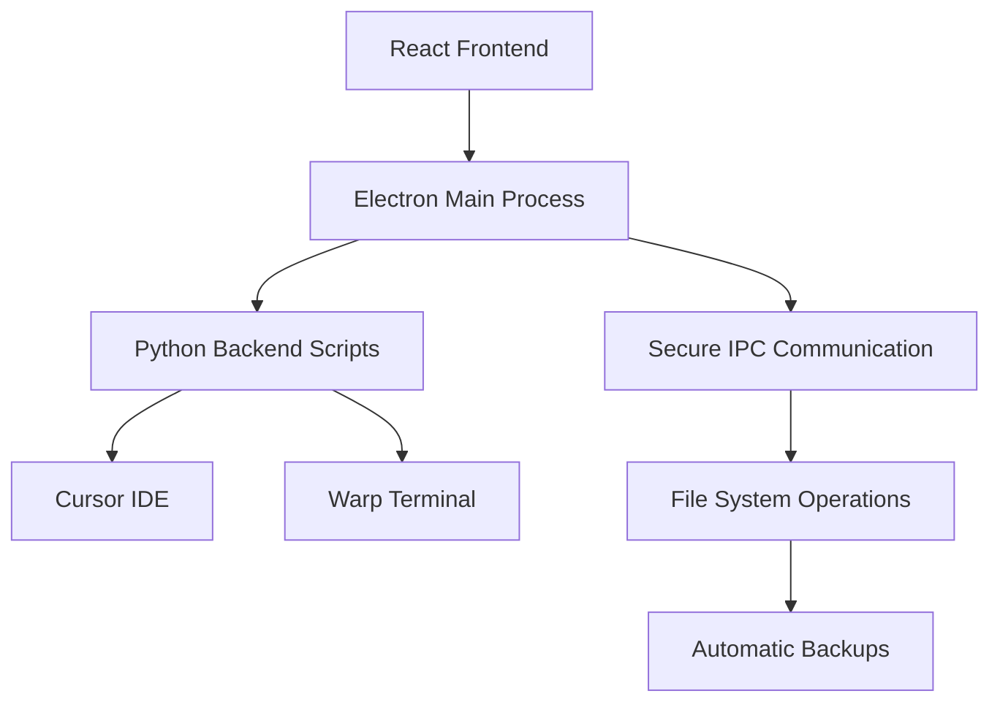

<div align="center">
  
  
  
  
  <br>
  
  
  
  
</div>

<div align="center">
  <h1>🚀 Cursor & Warp Bypass MaskID Suite</h1>
  <h3>Professional Cross-Platform GUI Application for Developer Tools Enhancement</h3>
  <p><em>A unified, secure, and user-friendly solution for bypassing limitations in popular developer tools</em></p>
</div>

<div align="center">
  <a href="#-features">Features</a> •
  <a href="#-installation">Installation</a> •
  <a href="#-usage">Usage</a> •
  <a href="#-development">Development</a> •
  <a href="#-contributing">Contributing</a>
</div>

---

## 🎯 About This Project

**Cursor & Warp Bypass MaskID Suite** is a comprehensive, professional-grade desktop application that provides a unified interface for bypassing limitations in popular developer tools. Built with modern web technologies and packaged as a native desktop application, it offers a secure and intuitive way to enhance your development environment.

### 🏗️ Architecture Overview



## ✨ Features

### 🔧 Cursor IDE Enhancement Suite

<details>
<summary><strong>📊 Token Limit Bypass</strong></summary>

- **Unlimited Requests**: Remove artificial token usage limitations
- **Enhanced Performance**: Boost AI assistance capabilities
- **Smart Caching**: Intelligent request optimization
- **Safety First**: Automatic backup before modifications
</details>

<details>
<summary><strong>🚀 Version & Feature Bypass</strong></summary>

- **Latest Features**: Access cutting-edge functionality
- **Pro Features**: Enable premium capabilities
- **Version Freedom**: Bypass version restrictions
- **Seamless Integration**: No workflow interruption
</details>

<details>
<summary><strong>🔐 Account Management Tools</strong></summary>

- **Multi-Account Support**: Manage multiple Cursor accounts
- **OAuth Integration**: GitHub and Google authentication
- **Token Management**: Secure credential handling
- **Session Persistence**: Maintain login states
</details>

### 🌊 Warp Terminal Enhancement Suite

<details>
<summary><strong>🔄 Identity Management</strong></summary>

- **Smart Reset**: Reset machine identity while preserving installation
- **Clean Slate**: Fresh start without reinstallation
- **Privacy Protection**: Remove tracking identifiers
- **Instant Activation**: Immediate functionality restoration
</details>

<details>
<summary><strong>🧹 Complete System Cleanup</strong></summary>

- **Deep Removal**: Completely uninstall Warp and all traces
- **Registry Cleanup**: Remove Windows registry entries
- **Cache Clearing**: Delete temporary and cache files
- **Preference Reset**: Restore system to pre-installation state
</details>

## 🌐 Platform Support Matrix

<table align="center">
  <tr>
    <th>Platform</th>
    <th>Architecture</th>
    <th>Cursor Tools</th>
    <th>Warp Tools</th>
    <th>Package Format</th>
    <th>Status</th>
  </tr>
  <tr>
    <td rowspan="2">🍎 <strong>macOS</strong></td>
    <td>Intel (x64)</td>
    <td>✅ Full Support</td>
    <td>✅ Full Support</td>
    <td>.dmg</td>
    <td>🟢 Production Ready</td>
  </tr>
  <tr>
    <td>Apple Silicon (ARM64)</td>
    <td>✅ Full Support</td>
    <td>✅ Full Support</td>
    <td>.dmg</td>
    <td>🟢 Production Ready</td>
  </tr>
  <tr>
    <td>🪟 <strong>Windows</strong></td>
    <td>x64</td>
    <td>✅ Full Support</td>
    <td>✅ Full Support</td>
    <td>.exe (NSIS)</td>
    <td>🟢 Production Ready</td>
  </tr>
  <tr>
    <td rowspan="2">🐧 <strong>Linux</strong></td>
    <td>x64</td>
    <td>✅ Full Support</td>
    <td>⚠️ Limited Support</td>
    <td>.AppImage</td>
    <td>🟡 Beta</td>
  </tr>
  <tr>
    <td>x64</td>
    <td>✅ Full Support</td>
    <td>⚠️ Limited Support</td>
    <td>.deb</td>
    <td>🟡 Beta</td>
  </tr>
</table>

## 📦 Installation

### 🎯 Quick Install (Recommended)

<details>
<summary><strong>🍎 macOS Installation</strong></summary>

1. **Download**: Get the latest `.dmg` file from [Releases](../../releases)
2. **Mount**: Double-click the `.dmg` file to mount it
3. **Install**: Drag the application to your Applications folder
4. **Security**: On first run, you may need to allow the app in System Preferences → Security & Privacy
5. **Launch**: Open from Applications folder or Spotlight search

```bash
# Alternative: Install via Homebrew (if available)
brew install --cask cursor-warp-bypass-suite
```
</details>

<details>
<summary><strong>🪟 Windows Installation</strong></summary>

1. **Download**: Get the latest `.exe` installer from [Releases](../../releases)
2. **Run as Administrator**: Right-click and select "Run as administrator"
3. **Install**: Follow the installation wizard
4. **Windows Defender**: You may need to allow the application through Windows Defender
5. **Launch**: Use the desktop shortcut or Start Menu

> **Note**: Administrator privileges are required for full functionality
</details>

<details>
<summary><strong>🐧 Linux Installation</strong></summary>

**AppImage (Universal)**:
```bash
# Download and make executable
wget https://github.com/black12-ag/cursor-and-warp-bypass-MaskID-/releases/latest/download/Bypass-Tools-Suite-1.0.0.AppImage
chmod +x Bypass-Tools-Suite-1.0.0.AppImage
./Bypass-Tools-Suite-1.0.0.AppImage
```

**Debian/Ubuntu (.deb)**:
```bash
# Download and install
wget https://github.com/black12-ag/cursor-and-warp-bypass-MaskID-/releases/latest/download/bypass-tools-suite_1.0.0_amd64.deb
sudo dpkg -i bypass-tools-suite_1.0.0_amd64.deb
sudo apt-get install -f  # Fix any dependency issues
```
</details>

### 🛠️ Build from Source

<details>
<summary><strong>Development Setup</strong></summary>

**Prerequisites**:
- Node.js 16+ ([Download](https://nodejs.org/))
- Python 3.6+ ([Download](https://python.org/))
- Git ([Download](https://git-scm.com/))

**Clone and Setup**:
```bash
# Clone the repository
git clone https://github.com/black12-ag/cursor-and-warp-bypass-MaskID-.git
cd cursor-and-warp-bypass-MaskID-

# Install Node.js dependencies
npm install

# Install Python dependencies
cd backend
pip install -r requirements.txt
cd ..

# Development mode
npm run electron-dev
```

**Production Build**:
```bash
# Build for current platform
npm run build
npm run dist

# Build for all platforms (requires platform-specific SDKs)
npm run dist-all
```
</details>

## 🚀 Usage Guide

### 🎨 User Interface Overview

<div align="center">
  
</div>

### 📋 Step-by-Step Workflow

1. **🚀 Launch Application**
   - Start the application with appropriate permissions
   - Windows users: Run as Administrator for full functionality

2. **🎯 Select Tool Category**
   - Choose between Cursor IDE or Warp Terminal tools
   - View detailed descriptions for each tool

3. **⚙️ Configure Settings**
   - Customize backup preferences
   - Set up notification preferences
   - Configure advanced options

4. **🔧 Execute Operations**
   - Follow guided setup wizards
   - Monitor real-time progress
   - Review operation logs

5. **✅ Verify Results**
   - Check operation success status
   - Review created backups
   - Test enhanced functionality

### 🛡️ Security & Safety Features

- **🔐 Automatic Backups**: Every operation creates timestamped backups
- **🔍 Pre-flight Checks**: Validate system state before modifications
- **🚨 Error Handling**: Graceful failure recovery and rollback
- **📝 Detailed Logging**: Comprehensive operation tracking
- **🔒 Permission Management**: Secure file system access

## 🏗️ Development

### 📁 Project Architecture

```
cursor-and-warp-bypass-MaskID-/
├── 📁 public/                    # Electron main process
│   ├── electron.js               # Main process entry point
│   ├── preload.js               # Secure renderer communication
│   └── index.html               # HTML template
├── 📁 src/                      # React frontend source
│   ├── 📁 components/           # Reusable React components
│   │   ├── About.js            # About information component
│   │   ├── CursorTools.js      # Cursor IDE tools interface
│   │   ├── WarpTools.js        # Warp terminal tools interface
│   │   ├── OutputTerminal.js   # Real-time output display
│   │   ├── Settings.js         # Application settings
│   │   └── SystemInfo.js       # System information display
│   ├── App.js                  # Main application component
│   ├── App.css                 # Global styles
│   ├── index.js               # React entry point
│   └── index.css              # Base CSS styles
├── 📁 backend/                  # Python backend scripts
│   ├── bypass_token_limit.py   # Token limit bypass logic
│   ├── bypass_version.py       # Version bypass implementation
│   ├── cursor_auth.py          # Authentication handling
│   ├── cursor_register.py      # Account registration
│   ├── oauth_auth.py           # OAuth integration
│   ├── warp_id_reset.py        # Warp identity reset
│   ├── warp_remover.py         # Complete Warp removal
│   ├── utils.py               # Utility functions
│   ├── config.py              # Configuration management
│   └── requirements.txt       # Python dependencies
├── 📁 scripts/                  # Build and utility scripts
│   ├── build.js               # Production build script
│   └── test.js                # Testing utilities
├── 📁 cursor-bypass-tool/       # Integrated cursor bypass tool
├── 📁 warp-bypass/             # Integrated warp bypass tool
├── package.json               # Node.js project configuration
├── package-lock.json          # Dependency lock file
├── .gitignore                 # Git ignore patterns
└── README.md                  # This file
```

### 🛠️ Available Scripts

```bash
# Development
npm start                 # Start React development server (port 3000)
npm run electron-dev      # Start Electron in development mode
npm test                  # Run test suite

# Production
npm run build            # Build React app for production
npm run electron         # Start Electron in production mode

# Distribution
npm run dist             # Build for current platform
npm run dist-all         # Build for all supported platforms

# Utilities
npm run postinstall      # Install Electron app dependencies
```

### 🔧 Technology Stack

<table>
  <tr>
    <td><strong>Frontend</strong></td>
    <td>
      
      
      
    </td>
  </tr>
  <tr>
    <td><strong>Runtime</strong></td>
    <td>
      
      
    </td>
  </tr>
  <tr>
    <td><strong>Backend</strong></td>
    <td>
      
      
    </td>
  </tr>
  <tr>
    <td><strong>Build Tools</strong></td>
    <td>
      
      
    </td>
  </tr>
</table>

### 🧪 Testing & Quality Assurance

- **Unit Testing**: Comprehensive component testing with Jest
- **Integration Testing**: End-to-end workflow validation
- **Cross-Platform Testing**: Automated testing on multiple platforms
- **Performance Monitoring**: Resource usage optimization
- **Security Auditing**: Regular dependency vulnerability scanning

## 🤝 Contributing

We welcome contributions from the developer community! Here's how you can help:

### 🚀 Getting Started

1. **Fork the Repository**
   ```bash
   git fork https://github.com/black12-ag/cursor-and-warp-bypass-MaskID-.git
   ```

2. **Create a Feature Branch**
   ```bash
   git checkout -b feature/amazing-new-feature
   ```

3. **Make Your Changes**
   - Follow the existing code style
   - Add tests for new functionality
   - Update documentation as needed

4. **Test Thoroughly**
   ```bash
   npm test                    # Run test suite
   npm run electron-dev        # Test in development mode
   npm run build && npm run dist  # Test production build
   ```

5. **Submit a Pull Request**
   - Provide a clear description of changes
   - Include screenshots for UI changes
   - Reference any related issues

### 📝 Contribution Guidelines

- **Code Style**: Follow existing patterns and use Prettier for formatting
- **Commit Messages**: Use conventional commits format
- **Documentation**: Update README and inline comments
- **Testing**: Maintain or improve test coverage
- **Performance**: Consider impact on application startup and runtime

### 🐛 Bug Reports

Found a bug? Please create an issue with:
- **Environment**: OS, version, architecture
- **Steps to Reproduce**: Detailed reproduction steps
- **Expected vs Actual**: What should happen vs what happens
- **Screenshots**: Visual evidence when applicable
- **Logs**: Relevant error messages or console output

### 💡 Feature Requests

Suggest new features by creating an issue with:
- **Use Case**: Why is this feature needed?
- **Proposed Solution**: How should it work?
- **Alternatives**: Other ways to solve the problem
- **Additional Context**: Screenshots, mockups, etc.

## ⚖️ Legal & Ethical Considerations

### 🎓 Educational Purpose Statement

> **IMPORTANT**: This software is provided for **educational and research purposes only**. Users are responsible for ensuring compliance with all applicable terms of service, licenses, and local laws.

### ⚠️ Disclaimer & Responsibilities

- **Risk Acknowledgment**: Use at your own risk - always backup your data
- **No Warranty**: Software provided "as-is" without guarantees
- **User Responsibility**: Comply with all applicable terms of service
- **Damage Disclaimer**: Authors not liable for any damages or consequences
- **Support Original Developers**: Consider purchasing legitimate licenses

### 🔒 Privacy & Security

- **No Data Collection**: We don't collect or transmit user data
- **Local Processing**: All operations performed locally on your machine
- **Open Source**: Full transparency through open source code
- **Security Audits**: Regular security reviews and updates

## 📄 License

<div align="center">
  
</div>

This project is licensed under the MIT License - see the [LICENSE](LICENSE) file for details.

## 🙏 Acknowledgments

### 👨‍💻 Core Contributors
- **[black12-ag](https://github.com/black12-ag)** - Original bypass tools and core functionality
- **Community Contributors** - Bug reports, feature requests, and improvements

### 🛠️ Technology Stack Credits
- **[React](https://reactjs.org/)** - Frontend framework
- **[Electron](https://electronjs.org/)** - Cross-platform desktop app framework
- **[Ant Design](https://ant.design/)** - Professional UI component library
- **[Python](https://python.org/)** - Backend scripting language

### 📚 Inspiration & References
- Original command-line tools that inspired this GUI implementation
- Developer community feedback and suggestions
- Open source projects that made this possible

---

<div align="center">
  <h3>🌟 Show Your Support</h3>
  <p>If this project helped you, please consider:</p>
  
  <a href="https://github.com/black12-ag/cursor-and-warp-bypass-MaskID-/stargazers">
    
  </a>
  
  <br><br>
  
  <p><em>Made with ❤️ by the developer community, for the developer community</em></p>
  
  <p>
    <a href="#-about-this-project">Back to Top ↑</a>
  </p>
</div>
